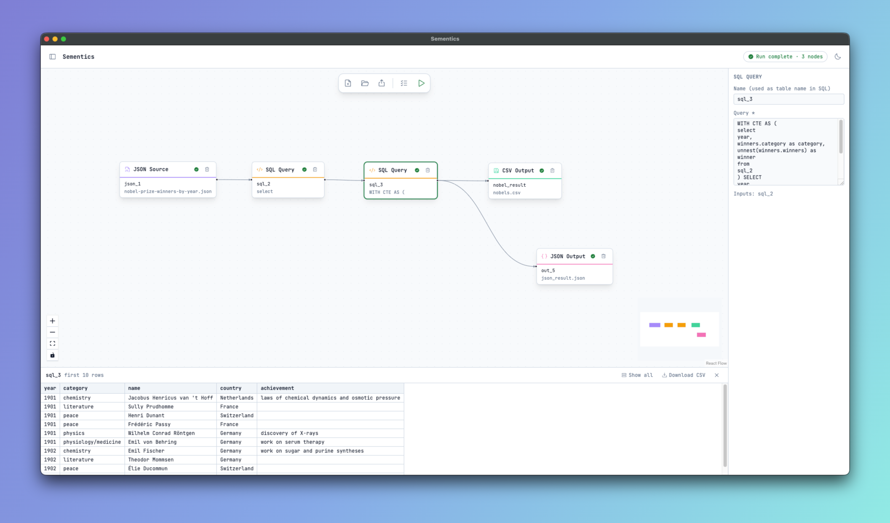

# Sementics

**Build data pipelines visually and run them locally with DuckDB.**

Sementics is a desktop app for building data workflows. You drag sources, SQL transformations and outputs onto a canvas and connect them. Workflows compile to DuckDB SQL and run on your machine. Nothing is uploaded, and there's no server to set up.



## Features

- **Visual workflow editor.** Drag nodes from the palette, connect them and configure each one in the side panel. Built on [React Flow](https://reactflow.dev).
- **CSV and JSON in and out.** Source nodes wrap DuckDB's `read_csv` / `read_json` and expose their options: delimiters, headers, NDJSON vs. array, nested-type detection, compression, globs, Hive partitioning and more. Output nodes write CSV, a JSON array or NDJSON.
- **SQL transformations.** A SQL node can query any upstream node by its name. You get the full DuckDB dialect: CTEs, `unnest`, window functions, structs and lists.
- **Run all or part of a workflow.** Run the whole workflow, or run a single node to preview its first rows. From the preview you can load up to 10,000 rows or download the result as CSV. Errors point to the node that failed.
- **Dry run with column lineage.** Checks every node without reading any data, shows each node's output schema and traces which upstream columns each column comes from.
- **Workflows are JSON files.** Export and open workflows as versioned files that are easy to diff and share.
- **Light and dark themes.** Follows your OS setting until you pick one.

## Getting started

Prebuilt downloads aren't available yet, so for now you build from source.

### Prerequisites

- **Node.js 20.19+ or 22.12+** (required by Vite) and npm
- macOS or Windows. Linux may work for development but isn't a packaging target yet.
- `duckdb` is a native module. Prebuilt binaries cover most platforms. If npm has to compile it, you need a C++ toolchain: Xcode Command Line Tools on macOS, or Visual Studio Build Tools on Windows.

### Run it

```bash
git clone https://github.com/vanandjiwala/sementics.git
cd sementics
npm install
npm run dev
```

`npm run dev` starts the Vite dev server on `:5173` and opens Electron pointed at it. Changes to the renderer (`src/`) hot-reload. Changes to `main.js` or `preload.js` need a restart.

### Your first workflow

1. Drag a **CSV Source** or **JSON Source** onto the canvas and set its file path (or click **Browse…**).
2. Add a **SQL Query** node, connect the source to it, and query the source by its node name, e.g. `SELECT * FROM json_1`.
3. Click the play button on the SQL node to preview its output.
4. Connect a **CSV Output** or **JSON Output**, set a path, and click **Run workflow** in the toolbar.
5. Use **Dry run** to check the workflow and see column lineage without reading any data.

## Scripts

| Command | What it does |
| --- | --- |
| `npm run dev` | Vite dev server + Electron with hot reload |
| `npm run build` | Build the renderer into `dist-renderer/` |
| `npm start` | Build, then run Electron against the built files |
| `npm run dist:mac` | Package a `.dmg` + `.zip` with electron-builder |
| `npm run dist:win` | Package an NSIS installer + portable `.exe` |

## How it works

```
┌──────────────── Renderer (React, sandboxed) ────────────────┐      ┌──── Main process ────┐
│ canvas ──► lib/pipeline.js ──► [{ nodeId, sql }] ───────────┼─IPC─►│ fresh in-memory      │
│   ▲         (topological compile)                           │      │ DuckDB, runs SQL,    │
│   └──── statuses / preview rows / schemas + lineage ◄───────┼──────┤ returns rows/errors  │
└─────────────────────────────────────────────────────────────┘      └──────────────────────┘
```

- **Main process** (`main.js`): owns the window, file dialogs and DuckDB. Every run uses a fresh in-memory database.
- **Preload** (`preload.js`): exposes a small, named `window.sementics` API. Each method maps to one `ipcMain.handle` channel.
- **Renderer** (`src/`): React + React Flow, bundled by Vite, with no Node access.
  - `data/nodeCatalog.js` is the registry of node types. The palette, node rendering, config panel and SQL compiler all read from it.
  - `lib/pipeline.js` compiles the graph into SQL: `CREATE VIEW` for sources and transforms, `COPY … TO` for outputs.
  - `lib/lineage.js` builds column-level lineage from a dry run's schemas.
  - `lib/workflowFile.js` serializes and validates workflow files.

[`CLAUDE.md`](CLAUDE.md) has a deeper architecture walkthrough and the project's Electron security rules.

### Project layout

```
main.js                 Electron main process (window, IPC, DuckDB)
preload.js              contextBridge API exposed to the renderer
src/
  App.jsx               Workflow state, execution, dry run, open/export
  components/           Canvas toolbar, palette, node, config panel, data preview
  data/nodeCatalog.js   Node type registry
  lib/                  pipeline, lineage, workflowFile (+ *.check.mjs self-checks)
  index.css             Tailwind v4 theme tokens (light + dark)
build/                  App icons, macOS entitlements, notarize hook
```

## Contributing

Contributions are welcome: bug reports, new node types, UX improvements and docs.

1. **Open an issue first** for anything non-trivial, so the approach can be agreed before you write code.
2. Fork the repo and create a branch from `main`.
3. Make your change, then run the self-checks and a build:
   ```bash
   node src/lib/pipeline.check.mjs
   node src/lib/lineage.check.mjs
   node src/lib/workflowFile.check.mjs
   npm run build
   ```
   There's no test runner or linter. Each `*.check.mjs` is a plain `node:assert` script. If you change logic in `src/lib/`, extend the matching check.
4. Try your change in the app (`npm run dev`), including light and dark themes if you touched the UI.
5. Open a pull request that explains what changed and why. Include a screenshot for UI changes.

### Adding a node type

Most new sources and outputs only need a catalog entry:

- Add an entry to `NODE_CATALOG` in `src/data/nodeCatalog.js` with `kind`, `category` (`input` / `transformation` / `output`), `label`, `icon`, `accent` and `params`.
- **Inputs** set `reader` (a DuckDB table function such as `read_parquet`). **Outputs** set `format` (a `COPY` format). `lib/pipeline.js` compiles them by category.
- Each param's `type` controls both its form field and how it's rendered into SQL: `text`, `number`, `bool`, `select`, or `raw` (inserted verbatim). Unset params are left out so DuckDB's defaults apply.
- File-path params use `browse: 'open' | 'save'` and a `fileType`. Add a matching entry to `FILE_FILTERS` in `main.js` if the type is new.
- Add assertions for the generated SQL to `src/lib/pipeline.check.mjs`.

### Ground rules

- **Keep Electron locked down.** Keep `contextIsolation` and `sandbox` on, keep `nodeIntegration` off, and expose only narrow preload functions. Every IPC handler validates its input and the sender frame. The renderer can run arbitrary SQL through DuckDB, so it must never load remote content.
- **Keep the CSP strict.** Bundle fonts and assets locally instead of loading them from a CDN.
- **No hard-coded colors in the UI.** Add a design token to both the dark and light blocks in `src/index.css`.
- `main.js` / `preload.js` are CommonJS and `src/` is ESM. Don't import Node or Electron modules from `src/`.
- Anything `main.js` needs at runtime goes in `dependencies`, not `devDependencies`.

## Packaging & releases

```bash
npm run dist:mac    # .dmg + .zip
npm run dist:win    # NSIS installer + portable .exe
```

- **Icons**: `build/icon.icns` (mac) and `build/icon.ico` (win) are picked up automatically.
- **macOS signing + notarization**: needed for the app to open without a Gatekeeper warning. Set these before `dist:mac`:
  - `CSC_LINK` / `CSC_KEY_PASSWORD`: Developer ID Application certificate (`.p12`)
  - `APPLE_ID`, `APPLE_APP_SPECIFIC_PASSWORD`, `APPLE_TEAM_ID`: used by `build/notarize.js`

  Without them, `dist:mac` still builds, but the app is unsigned and not notarized.
- **Windows signing**: set `CSC_LINK` / `CSC_KEY_PASSWORD` to a code-signing certificate before `dist:win`. Without one, the installer triggers a SmartScreen warning.
- Bump `version` in `package.json` before each release build.
- Credentials come from environment variables only. Never commit them.

## Built with

[Electron](https://www.electronjs.org) · [React](https://react.dev) · [React Flow](https://reactflow.dev) · [DuckDB](https://duckdb.org) · [Vite](https://vite.dev) · [Tailwind CSS](https://tailwindcss.com) · [sqlingo](https://www.npmjs.com/package/sqlingo) · [Phosphor Icons](https://phosphoricons.com)

## License

[MIT](LICENSE) © Vasav Anandjiwala
